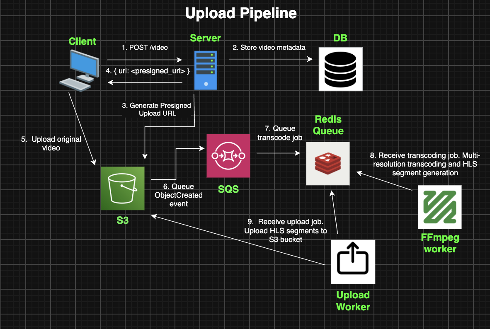
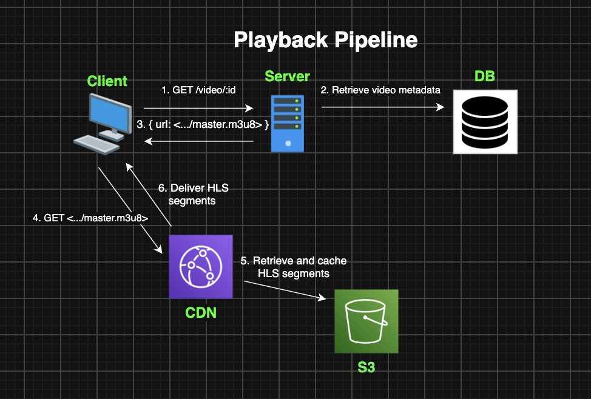
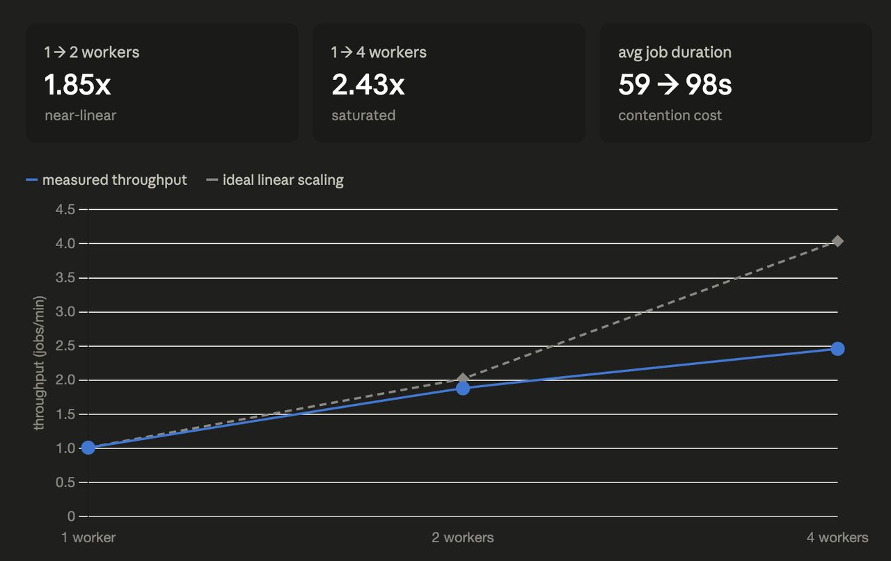

# Encodr
An event-driven, scalable video transcoding pipeline that ingests video, transcodes it into multiple resolutions 
and serves HLS segments through a CDN. 

Video transcoding is a compute-intensive process which places importance on building a pipeline that is scalable. I built this as a from-scratch implementation of the core pattern behind services like Netflix or Mux.

## Live Site
Visit the [Live Site](https://encodr.pavelbratan.com/).

Credentials are needed to access the live site. Contact pavelbratan2@gmail.com for access.

Architecture — your diagram, then a prose walk through the flow: client requests a presigned URL, uploads directly to S3, S3 fires an event to SQS, the backend consumes it and enqueues transcode jobs to BullMQ, workers probe the source and generate an adaptive bitrate ladder, transcode to HLS, upload renditions back to S3, and CloudFront serves them to an HLS.js player.

## Architecture
### Upload Pipeline

Client requests POST /video to a REST API and sends video metadata in the body.

Video metadata gets stored in a Postgres DB. The API signs a presigned upload URL and hands it back to the client.

The client uses this presigned upload URL to upload the original video to an S3 storage bucket.

Once upload is completed, S3 storage bucket emits an ObjectCreated event and it gets queued in SQS.

A SQS consumer process consumes the event from SQS. It queues a transcoding job in a queue on a Redis server.

Transcode workers pick up jobs off the Redis queue and run FFmpeg processes. They transcode the original video and generate HLS segments and manifests. They queue an upload job in Redis once done.

Upload worker picks up an upload job and uploads the transcoded segments and their manifests back to the S3 storage bucket.

### Playback Pipeline

Client requests GET /video/:id

Server retrieves video metadata from Postgres and a Cloudfront CDN URL to the master manifest.

Client requests the CDN URL for the master manifest.

CDN retrieves and caches segments for low-latency delivery to the client.

## Key engineering decisions

### Dynamic bitrate ladder
The height of the video gets probed with FFprobe. Determining which resolutions to transcode to is decided by a ladder. The rungs on the ladder, correspond to different pixel heights (1080p, 720p, 480p).

Rung selection works like this: only select heights that are equal to or less than the original height. This avoids spending unneccesary compute on upscaling a video which produces garbage.

### Event-driven ingestion
Ingestion of videos is event driven. The client uploading their original video to S3 gets decoupled from transcoding through use of an event queue (SQS).

Why do this? SQS makes the two sides independent. Uploads complete at whatever rate clients send them. Transcoding proceeds at whatever rate workers can sustain. The queue absorbs the difference and holds events durably until a consumer is available to handle them.

### CPU-bound vs IO-bound worker separation 
The job queue distinguishes between two types of workers. Transcoding (CPU-bound) workers and Upload (IO-bound) workers.
They get separated because they require different scaling strategies. 

Transcode is compute intensive, taking up CPU cores (~1.3 cores in this pipeline). Running too many on the same box results in CPU contention. Scaling this would quickly require a horizontal scaling strategy (running on multiple boxes).

Upload is waiting intensive, they send an upload request over the network and sit and wait most of the time. We can run many upload jobs at the same time without worrying about them taking up the CPU.

### Scaling benchmark test

This benchmark is to test the scaling potential of the transcoding section of this pipeline on a single box.

Constants: Ran on Macbook M1 Laptop (8 cores), queued a batch of the same 24 videos.
Variables: Worker count 1 -> 2 -> 4.

Results:

Throughput increases: 1.85x with 2 workers, 2.43x with 4 workers.

This shows the realites of scaling a CPU intensive process on a single system. Running multiple CPU intensive workers on one box doesn't result in a proportionate increase in workers due to CPU contention.

### Tech stack

TypeScript, Express, BullMQ/Redis, Postgres, FFmpeg, S3, SQS, EC2, CloudFront, Docker.
